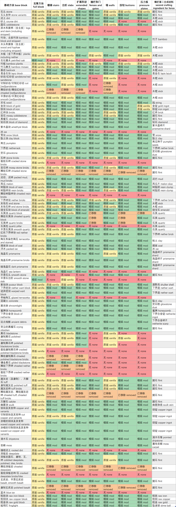

# 方块列表 List of blocks

## 说明

- **原版**：该方块在原版就有。
- **模组**：该方块在模组中加入。
- **无**：该方块在原版和模组中均不存在。
- **已移除**：从 Minecraft 1.20.4 的快照版本开始被移除。从旧版本升级世界时，将被替换成未被移除的方块。
- 扩展的形状包括：竖直楼梯、竖直台阶、横条、纵条。

### Description

- **vanilla**: The block exists in vanilla Minecraft.
- **mod**: The block is added in this mod.
- **none**: The block exists in neither vanilla Minecraft nor this mod.
- Extended shapes include: vertical stairs, vertical slabs, quarter pieces, vertical quarter pieces.

